# 1. Microservice와 Spring Cloud의 소개

# 모놀리스 아키텍쳐와 마이크로 서비스 아키텍처 비교
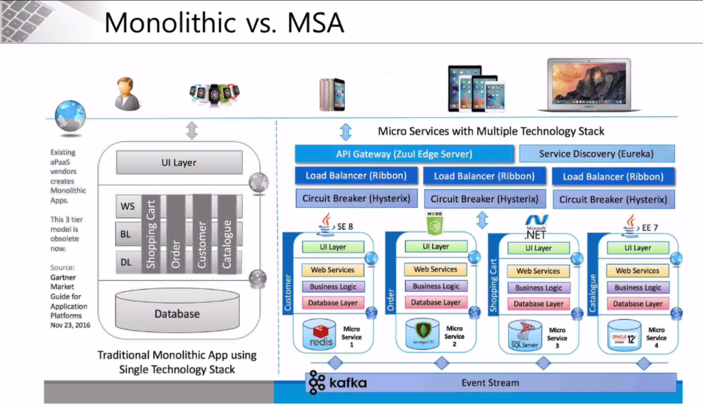  
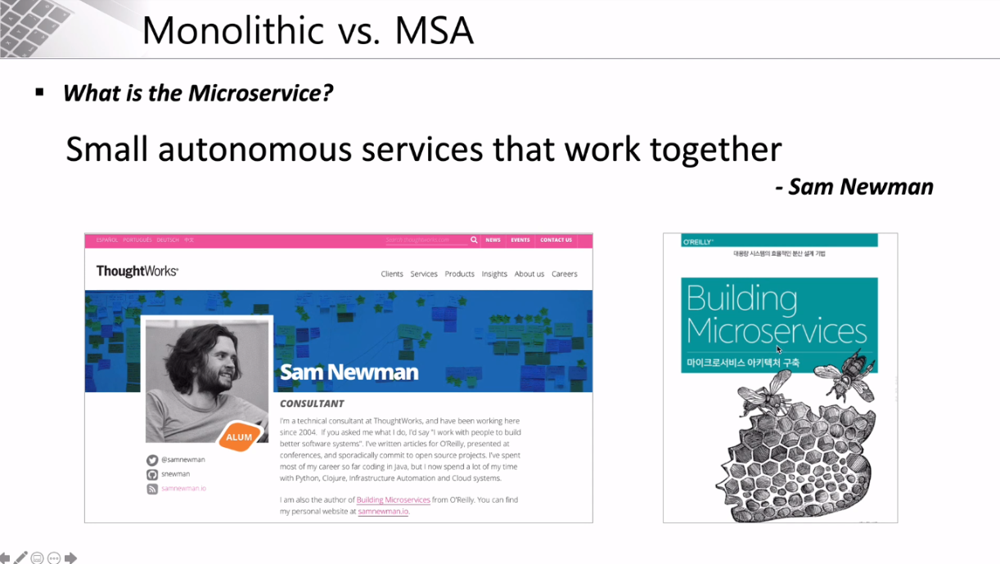  
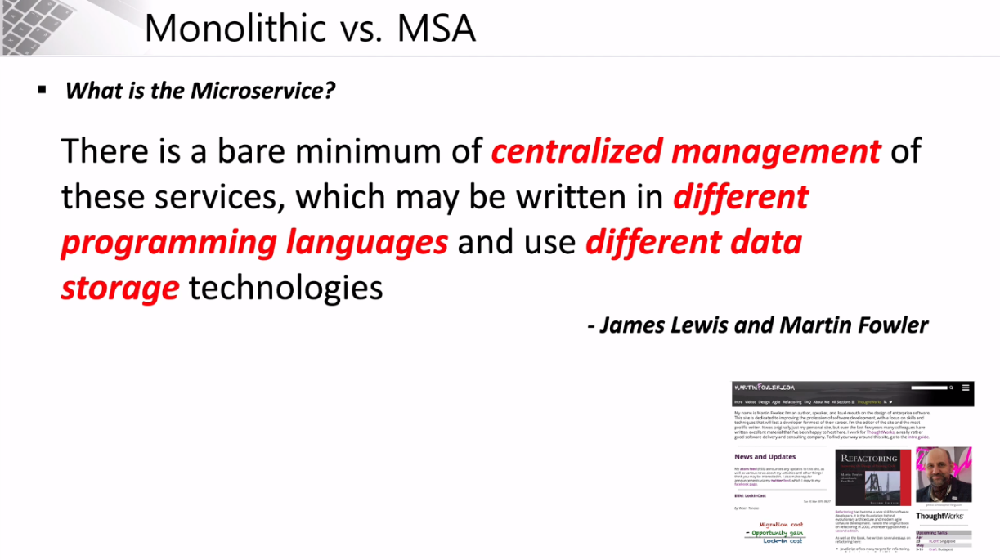  
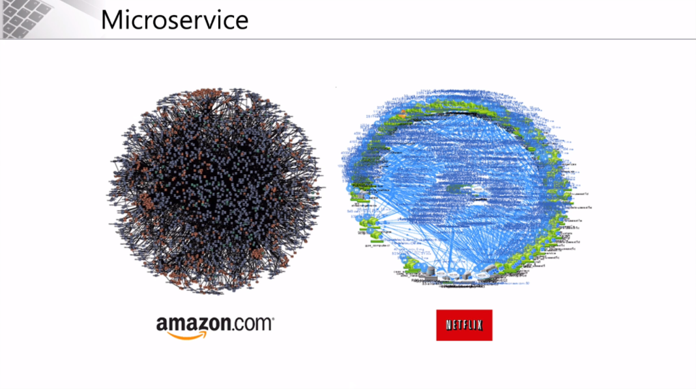  
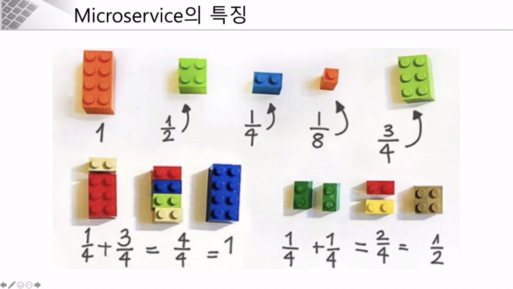  
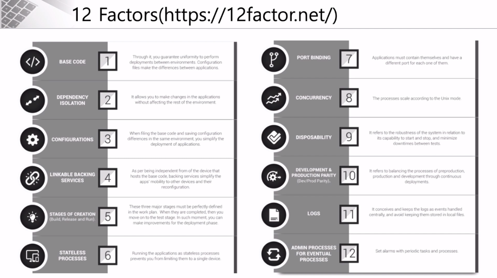  
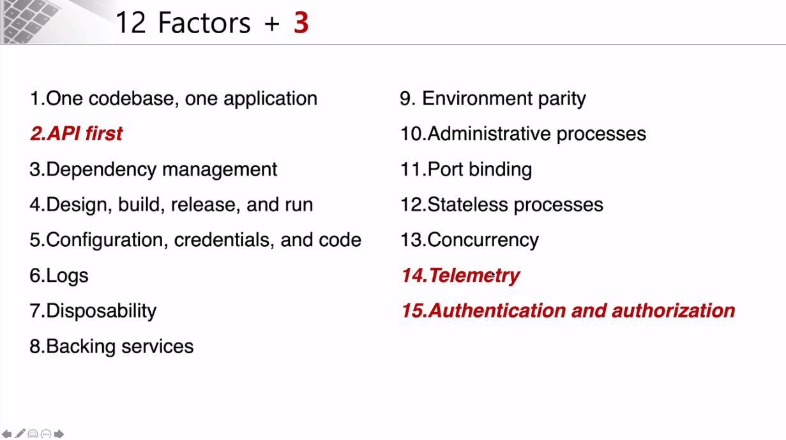  
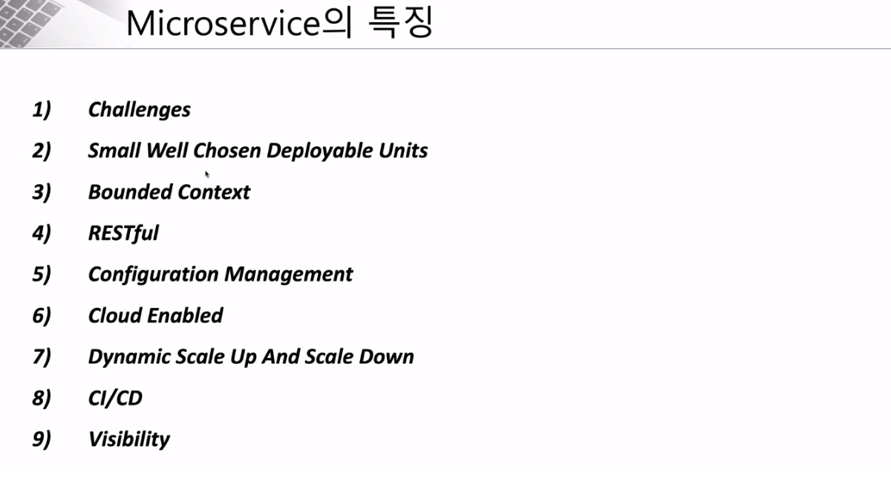  

# SOA vs MSA
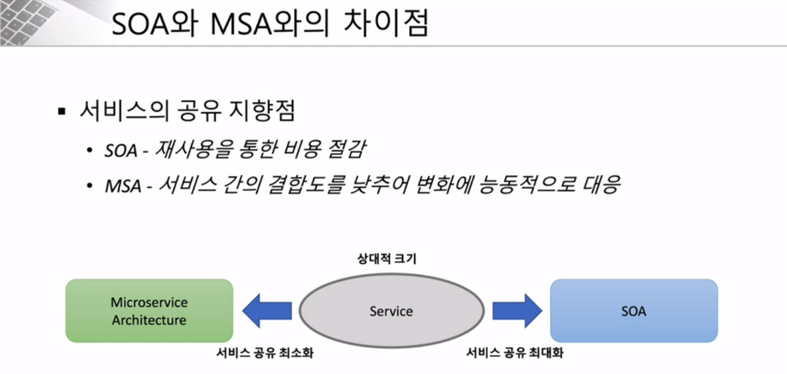  
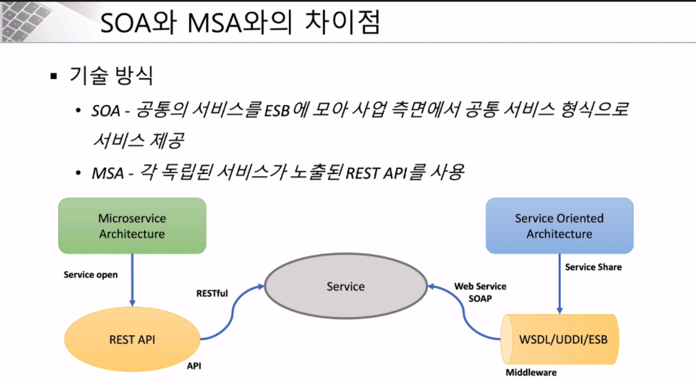  
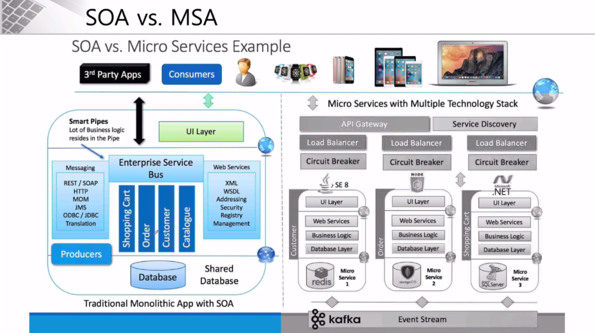  

# MSA 표준 구성요소
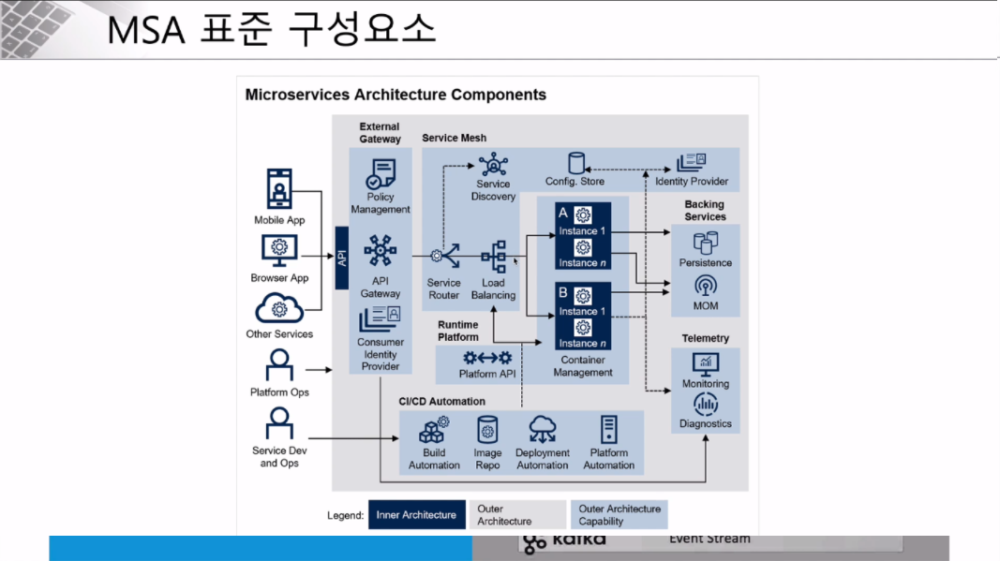  
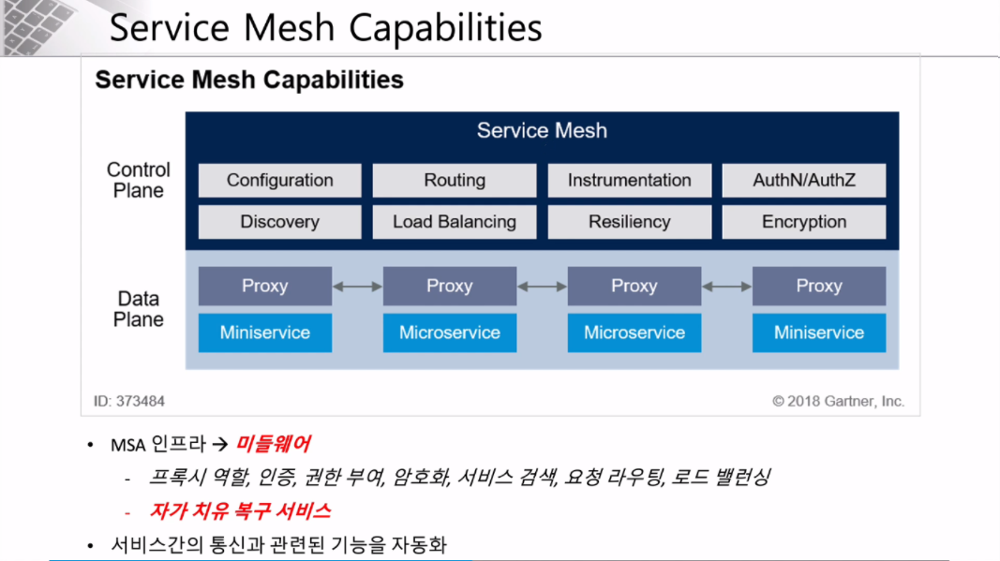  

# MSA에 사용되는 기술과 서비스들
- [https://landscape.cncf.io/](https://landscape.cncf.io/)  
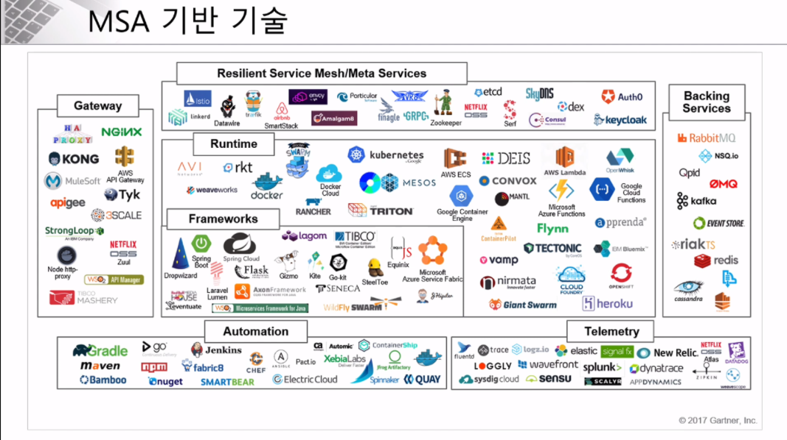  

# Spring Cloud란?
독립적으로 MSA서비스를 개발을 지원하기 위한 프레임워크 - [링크](https://spring.io/projects/spring-cloud)  
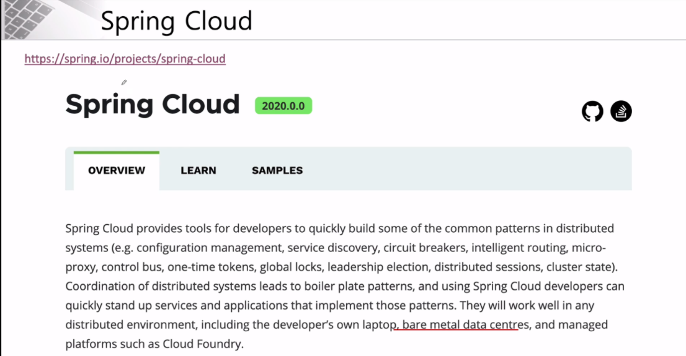  
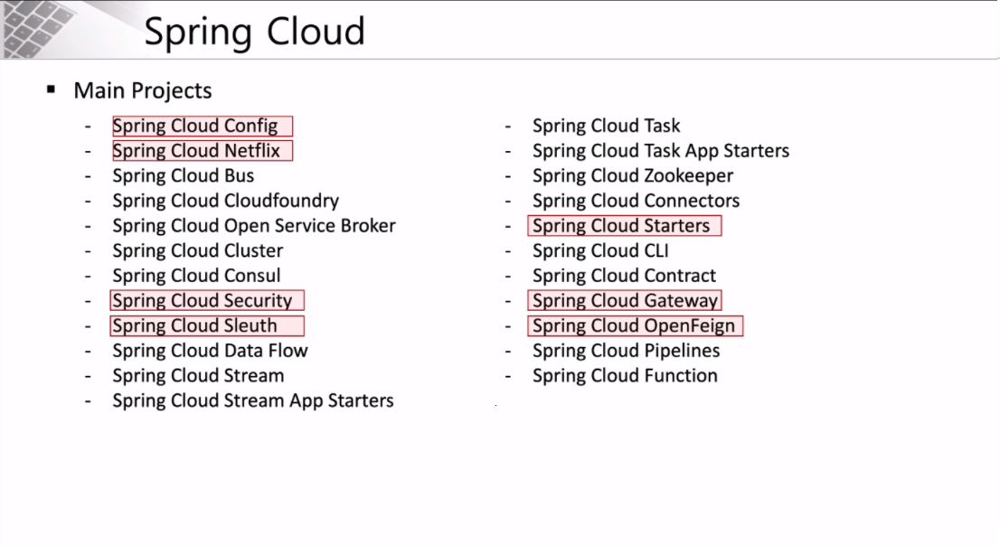  
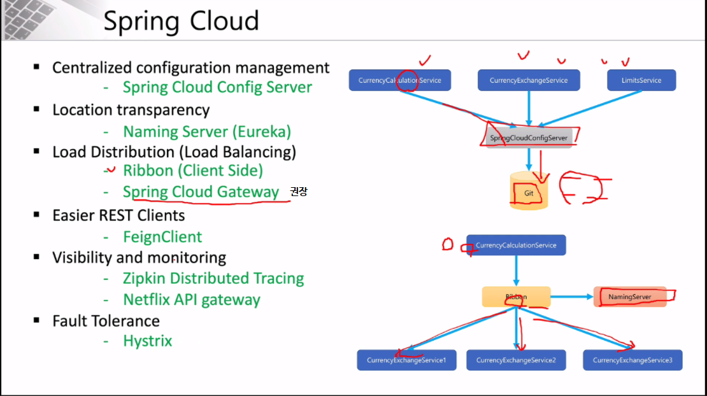  

