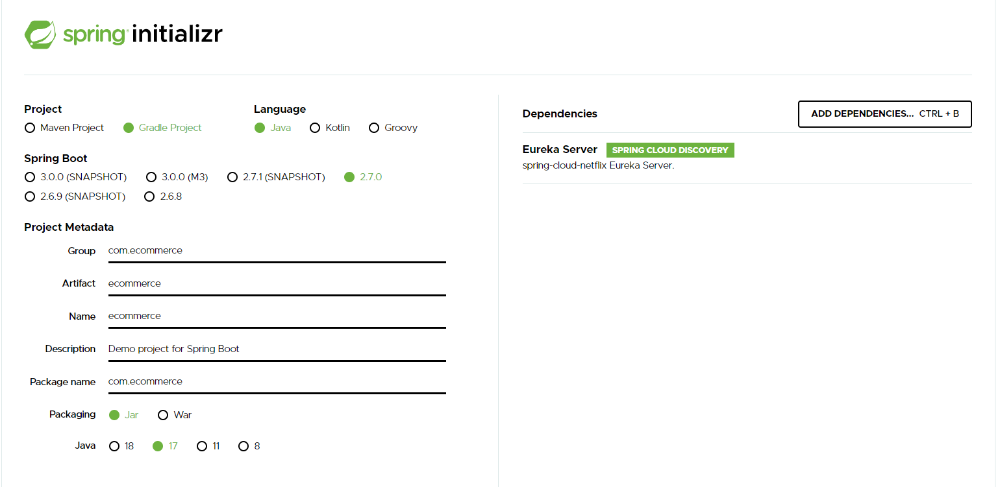
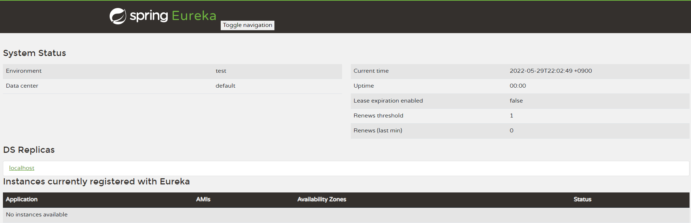
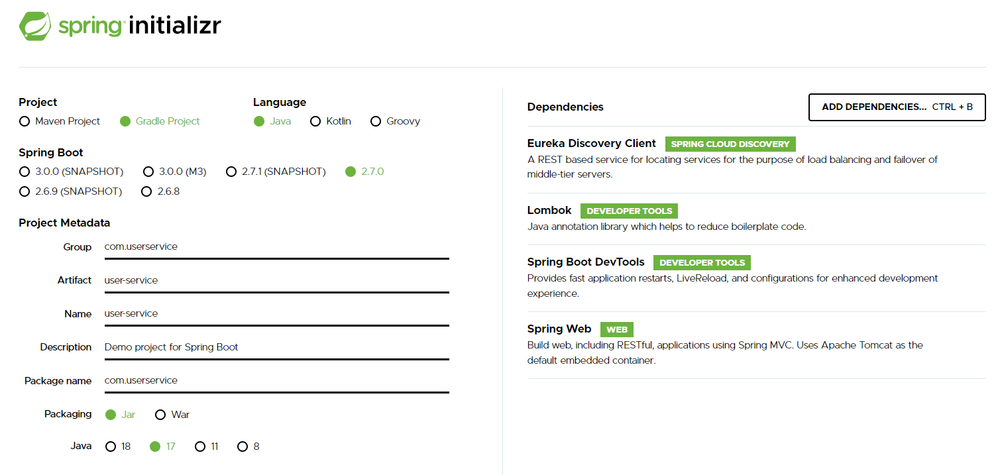
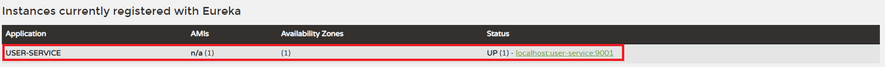

# 2-1. Spring Cloud Netflix Eureka  
마이크로 서비스 검색을 위해 사용되는 서비스 (전화번호부 생각)  
  
1. 마이크로 서비스는 서비스 디스커버리에 등록한다.  
2. 클라이언트는 로드밸런서를 통해 서비스 디스커버리에 접속 하면 클라이언트가 찾으려는 서비스의 위치를 알려준다.  
3. 클라이언트는 서비스 디스커버리에 의해 찾은 서비스에 요청하여 서비스를 이용한다.  

## SpringBoot 의존성 설정
  

스프링 부트가 유레카 서버로서 작동하기 위해서는 `@EnableEurekaServer`를 설정해줘야한다.
```java
@SpringBootApplication
@EnableEurekaServer
public class DiscoveryserviceApplication {

    public static void main(String[] args) {
        SpringApplication.run(DiscoveryserviceApplication.class, args);
    }

}
```

`application.yml` 설정은 다음과 같다
```yml
server:
    port: 8761
spring:
    application:
        name: discoveryserivce # 마이크로 서비스의 이름을 설정한다 - 여기서는 유레카 서비스의 이름

eureka:
    client:
        register-with-eureka: false # 자기자신의 정보를 서비스 디스커버리에 등록하지 않도록 설정
        fetch-registry: false       # 자기자신의 정보를 서비스 디스커버리에 등록하지 않도록 설정
```

<유레가 서버 아이피>:<포트>로 접속하여 유레카 대시보드가 표시되는지 확인한다.
  

## 유레카 클라이언트 역할의 UserService 프로젝트 생성
  

`@EnableDiscoveryClient`를 활성화 시킨다.
```java
@SpringBootApplication
@EnableDiscoveryClient
public class UserServiceApplication {

	public static void main(String[] args) {
        SpringApplication.run(UserServiceApplication.class, args);
	}

}
```

`application.yml` 파일을 다음과 같이 설정한다.
```yml
server:
  port: 9001

spring:
  application:
    name: user-service # 마이크로 서비스의 이름을 설정한다

eureka:
  client:
    register-with-eureka: true # 서비스 디스커버리에 서비스 등록 설정
    fetch-registry: true # Eureka 서버로부터 인스턴스들의 정보를 주기적으로 가져올 것인지 설정하는 속성
    service-url: 
      defaultZone: http://localhost:8761/eureka # 유레카 클라이언트가 서비스를 등록할 서버 주소 
```

애플리케이션 실행 후 유레카 대시보드에서 애플리케이션이 잘 등록되었는지 확인한다.
  